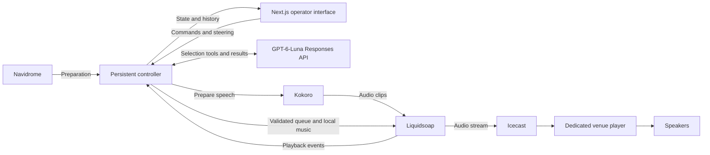

# AI DJ v1 design

Status: agreed on 2026-09-26. Controller and venue audio implementation is in progress; a synthetic end-to-end stream has passed, but the full venue rehearsal is pending.

## Stated brief

Build a lighter version of Subwave for a nightclub DJ event. An agentic LLM selects the next track using track metadata. Music comes from Navidrome. The DJ can speak between tracks using Kokoro TTS.

The requested stack is Next.js, Icecast, and Liquidsoap. Next.js provides the operator interface, a separate persistent controller manages selection and the queue, and Liquidsoap handles audio sent through Icecast.

## Reference findings

Subwave separates its persistent controller from its Next.js UI. Liquidsoap handles playback and sends audio to Icecast. Its picker merges Navidrome metadata with local enrichment, including mood, energy, BPM, and key. The new app's available metadata has not yet been verified.

Subwave prepares Kokoro speech as audio files. Liquidsoap has speech queues and ducking, plus a music fallback when the controller has no next selection ready. The inspected mixer implements crossfades; the inspection did not establish a general beatmatching implementation.

Reference files in `../subwave/`:

- `controller/src/llm/internal/tools/picker/slim.ts`: candidate metadata enrichment.
- `controller/src/broadcast/dj-agent/agents.ts`: selection agent.
- `controller/src/music/subsonic.ts`: discovery and playback sources.
- `controller/src/audio/kokoro.ts`: persistent speech worker.
- `liquidsoap/radio.liq`: queue, fallback, mixing, speech, and broadcast output.

## Agreed scope

- Play full tracks with smooth crossfades. Beatmatched, phrase-aware mixing is outside v1.
- Select tracks autonomously. An operator can skip, force the next track, and mute speech.
- Serve one venue sound system in v1.
- Choose tracks only from an approved event pool.
- Use occasional short speech between tracks. Speech is optional.
- Prepare the event pool from one Navidrome playlist and freeze membership for the event.
- Take an initial written event brief and live text steering instructions. Steering affects upcoming selections.
- Do not repeat tracks within an event. Leave at least 30 minutes between tracks by the same artist. Alert the operator if the pool cannot satisfy these constraints.
- Run playback on a machine at the venue.
- Prepare the approved music locally before starting, with a fallback order for the whole event if the LLM or internet becomes unavailable.
- Omit speech when TTS fails.
- Fade outgoing music, play a prepared speech clip of at most eight seconds, and then start the next track. Speech does not overlap vocals. Allow at least 20 minutes between announcements, with longer silent stretches allowed. Content is limited to music and supplied event details. Omit late or overlong clips.
- Target a four-hour event initially, with five hours of approved playback coverage in total, including the one-hour reserve.
- Warn before pool exhaustion. Repeats require the operator to explicitly enable them; the agent cannot silently relax rules.
- Operators may override repetition and artist-spacing rules with a warning, but selections must remain inside the event pool.
- Show the current track, the next two selections with short reasons, and playback history. Let the operator replace and reorder upcoming tracks. An incoming track is committed when its transition begins.
- Support controls on the venue machine and phones on the venue network through one password-protected interface.
- At the scheduled end, finish the current track and stop. Provide an immediate fade-out command and an event-extension command.
- Use available Navidrome metadata, the event brief, and optional operator notes. Use richer metadata when present; do not invent missing measurements or require a new analysis pipeline for v1.
- Give the agent tools to search the event pool, inspect candidates, and read history. Validate its selection against eligibility and repetition rules in application code.
- Keep the Next.js interface separate from a persistent controller. Run the controller, Liquidsoap, Kokoro, and Icecast on the venue machine. Closing the website must not stop playback.
- Use `gpt-6-luna` through the OpenAI Responses API with a server-side API key.
- Feed the speakers through a dedicated local player consuming Icecast. Phones are controls, not the venue audio source. Measure command-to-audible latency on the actual setup.
- Persist the event, queue, and history. Recover controller failures automatically where music can continue. After a full machine reboot, require operator resume and start a fresh track without replaying stale speech.
- Live steering replaces uncommitted agent selections while preserving operator-selected or operator-reordered tracks. Discard speech associated with replaced selections.
- Stop after advance warnings if no eligible music remains and the operator has not authorized repeats. At exhaustion, the no-repeat rule takes precedence over continuity.
- Preparation verifies the local music and an eligible fallback order with five hours of coverage after accounting for crossfade overlap.
- Target Linux first. Package services in Docker Compose and run the dedicated audio player on the host.

## Metadata inspection

Read-only inspection of Subwave's default local `state/library.db` found zero tracks. Its schema and enrichment code support richer metadata, but this checkout does not supply a populated catalog to reuse. The live Navidrome library and any separately deployed enrichment service have not been inspected.

Subwave's source defaults to an Ollama provider. This is a code default, not evidence of the active provider or an agreed choice for this app. Its playlist resolver refreshes cached membership, so event-pool freezing must be deliberate in this app.

## Model integration evidence

The [official GPT-6-Luna model page](https://developers.openai.com/api/docs/models/gpt-6-luna) documents the model ID `gpt-6-luna`, function calling, and structured outputs. It recommends the Responses API for function calling. [OpenAI's production guidance](https://developers.openai.com/api/docs/guides/production-best-practices) documents API-key authentication. The agreed integration uses direct Responses API access with a server-side key.

## Agreed operational defaults

- Bound each selection attempt to 30 seconds and six tool calls. Keep valid queued music, fill missing slots from eligible fallback tracks, and retry AI selection in the background with backoff. Returning AI selection must preserve protected selections and the incoming track of a transition already in progress.
- Restart failed audio services automatically during a running event. A mixer restart continues with a fresh eligible track and discards stale speech. A player reconnect joins the live stream. Surface the interruption in the operator UI. Never restart an ended event automatically; a full machine reboot still requires explicit resume.
- Begin with a five-second music crossfade and two-second skip/end fades. Target no more than three seconds from a control command to the start of its audible effect on the venue system. Treat this as a rehearsal acceptance target to measure, not a proven capability.
- Treat the planned end as a cutoff for starting tracks. Any incoming track whose transition began before the cutoff may finish. Suppress new announcements at the cutoff.
- Block starting when local music or fallback coverage fails preparation. Permit an explicit music-only fallback start when only the AI or speech service is unavailable. Preparation must account for transition overlap when measuring available playing time.

## Service responsibilities

The controller owns the planned queue. Liquidsoap reports what actually plays, including fallback tracks, so history and eligibility reflect playback rather than merely successful model requests. Local fallback playback must remain available through controller and network failures. The service diagram shows responsibilities, not a choice of IPC transport or storage library.

## Acceptance checks

These are the full v1 acceptance checks. Controller unit tests and a short synthetic Icecast rehearsal cover only part of them.

- Prepare the frozen pool and required fallback coverage, then run a four-hour rehearsal on the venue setup.
- Verify internet loss, LLM failure, TTS failure, controller restart, and closing the web interface do not create unintended silence while eligible local music remains.
- Exercise operator skip, force-next, reorder, steering, speech mute, end, and extension commands. Automatic replanning must preserve protected selections and committed transitions.
- Reject out-of-pool model selections and unauthorized repetition. Verify fallback history also affects eligibility. Exercise exhausted pools and operator-authorized overrides.
- Verify speech duration and spacing, omitted late or failed clips, and cancellation of speech for replaced tracks.
- Measure command-to-audible delay against the operational target. Distinguish the start of an audible fade from its completion.
- Exercise audio-service recovery and verify interruptions are visible. Audio-service failure can interrupt sound; this recovery check does not claim seamless playback through mixer failure.
- Verify end-time behavior and explicit resume after a full machine reboot. Ended events must remain stopped.

## Setup inputs

These are deployment inputs rather than unresolved product decisions: Navidrome endpoint and credentials, source playlist, OpenAI API key, venue machine and audio device, operator password, selected Kokoro voice, and the event brief and timing. No first-event deadline has been supplied. Credentials belong in deployment configuration, not these documents.

## Related documents

- [Domain glossary](../CONTEXT.md)
- [Approved event pool](adr/0001-event-pool-selection.md)
- [Offline venue preparation](adr/0002-prepare-music-for-offline-playback.md)
- [Independent playback controller](adr/0003-separate-controller-from-web-interface.md)
